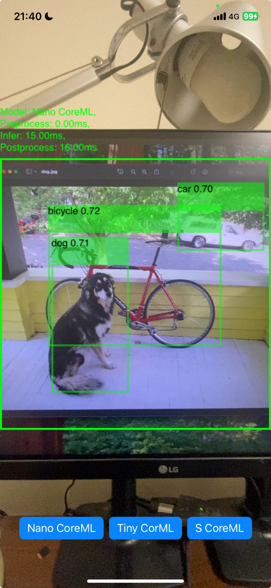

# yolox-executorch-ios

<p align="center">
  
</p>

This is a demo project for running YOLOX on iOS devices using [Executorch](https://github.com/pytorch/executorch)

The feature of this demo project is:

- [x] Execute YOLOX model on iOS devices using Executorch
- [x] Use [BYTETracker](https://github.com/kadu-v/jamtrack-rs) to track detected objects

## How to run

```bash
# Clone the project
$ git clone git@github.com:kadu-v/yolox-executorch-ios.git

# Download the executorch library
$ ./scripts/setup-engine.sh

# Build the swift package
$ ./scripts/build-pkg.sh

# Open the project in Xcode
$ open ios/app/ET-YOLOX/ET-YOLOX.xcodeproj/
```

Add the built swift package to the project and run the project on a real device.
